# 💫 About Me

- 🎓 **Computer Engineering** graduate from **Koç University**
- 🎮 Currently building **PocketPet**, a mobile game, with **Unity & C#**
- 🌊 SSI Divemaster — spent a month working on a dive boat in Kaş, Türkiye
- 💬 Ask me about **anything you want**
- ⚡ Fun fact - The first "computer bug" was an actual bug!

---

## 🌐 Connect With Me

---

## 💻 Tech Stack

### Programming Languages

### Game Development

### Frontend & Mobile

### Databases & Cache

### DevOps & Tools

### Design

---

## 📊 GitHub Statistics

---

## 🎯 What I'm Working On

- 🎮 Building **PocketPet**, a mobile pet simulation game, in Unity & C#
- 🏰 Led development on **RokueQuest**, a Java/Swing roguelike dungeon crawler
- 📱 Cross-platform apps with Flutter, React, and native Swift/ARKit
- 🧠 Exploring AI-assisted development workflows

---

## 🏆 Background

- 🎓 B.S. in Computer Engineering, Koç University
- 💼 Software engineering internships at Yapı Kredi Teknoloji, IBTECH, and TEGSOFT
- 🎮 Strong foundation in OOP, game architecture, and design patterns
- 🌊 SSI Divemaster, former board member of KUSAS (Koç University Underwater Sports Club)
- 🥏 Ultimate frisbee team captain (Koç Ramses, 2023–2024 season)

---

## 📞 Get In Touch

I'm always interested in discussing:
- Game development (Unity, C#, game architecture)
- Mobile development (Flutter, React, Swift)
- Java and design patterns
- AI-assisted development
- Collaborative projects

Feel free to reach out through any of my social media links above or via email!

### Thanks for visiting my profile! 👋

**Always learning, Always building. 🎮**

